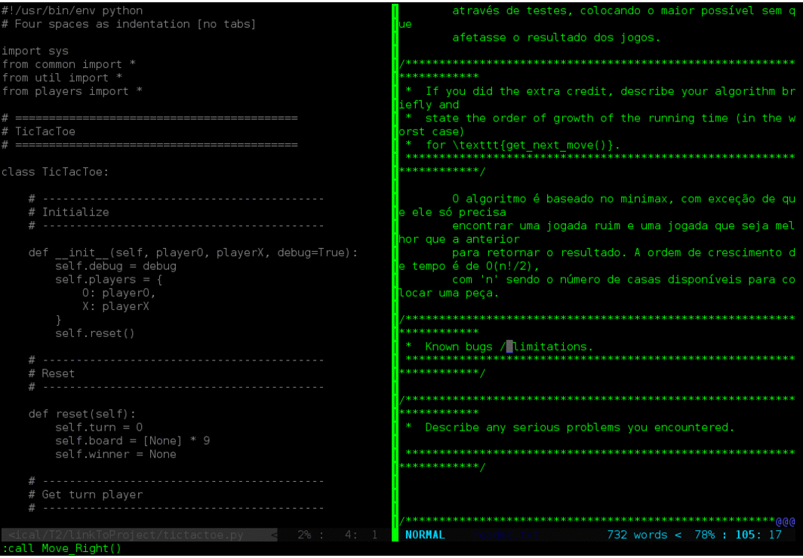

# focus-tab.vim

# Usage
bind
	Move_Right()
	Move_Down()
	Move_Left()
	Move_Up()
to the keys you normally use to move between windows.
e.g:
	nnoremap <C-W>l :call Move_Right()<CR>
	nnoremap <C-W>j :call Move_Down()<CR>
	nnoremap <C-W>h :call Move_Left()<CR>
	nnoremap <C-W>k :call Move_Up()<CR>

# TODO:
	add mouse support
